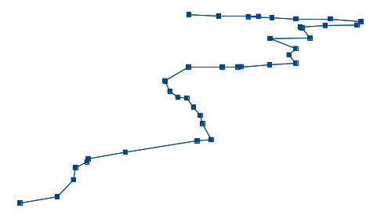
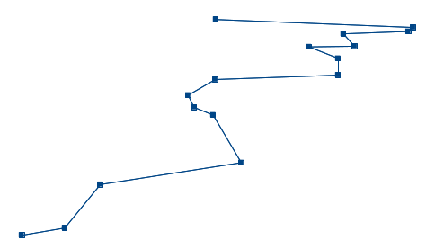

# RDP-PHP
PHP implementation of the [Ramer–Douglas–Peucker](http://en.wikipedia.org/wiki/Ramer%E2%80%93Douglas%E2%80%93Peucker_algorithm) algorithm for polyline simplification.

License: Public Domain

### Ramer–Douglas–Peucker example ###

##### Original polyline #####

(100, 100), (181, 133), (216, 221), (220, 283),
(245, 314), (248, 330), (328, 364), (483, 424),
(513, 429), (494, 513), (489, 555), (475, 598),
(460, 645), (441, 649), (424, 680), (414, 733),
(413, 735), (464, 806), (537, 806), (570, 807),
(577, 808), (639, 818), (695, 826), (681, 869),
(695, 902), (640, 954), (726, 957), (709, 1009),
(705, 1013), (759, 1022), (827, 1024), (836, 1042),
(770, 1056), (696, 1056), (644, 1062), (593, 1067),
(615, 1069), (529, 1070), (465, 1078)

##### After running simplification with epsilon '15' #####

(100, 100),
(181, 133),
(248, 330),
(513, 429),
(460, 645),
(424, 680),
(413, 735),
(464, 806),
(695, 826),
(695, 902),
(640, 954),
(726, 957),
(705, 1013),
(827, 1024),
(836, 1042),
(465, 1078)

### Installation ###

    composer require david-r-edgar/rdp

### Example usage ###

    use davidredgar\polyline\RDP;

    $line = array(
        array(150, 10),
        array(200, 100),
        array(360, 170),
        array(500, 280));

    $rdpResult = RDP::RamerDouglasPeucker2d($line, 30);

`$rdpResult` will contain a resulting array with the reduced number of points. For this example:

    $rdpResult == array(
        array(150, 10),
        array(200, 100),
        array(500, 280));

The second parameter to `RamerDouglasPeucker2d()` is epsilon, the maximum perpendicular distance for any point from the line between two adjacent points. Try replacing it with, say, 10 or 50 and observe the results.

### Use for geographic purposes ###

I originally implemented this in order to simplify a complex route on a map. Because I was doing this in Great Britain with OSGB36 coordinates, this worked.

However, be careful if you want to want to attempt this with other coordinate systems. The algorithm assumes cartesian coordinates on a 2D plane. Attempting to use latitudes and longitudes on the surface of a sphere will result in incorrect results. For approximate polyline simplification, the results *may* still be acceptable. As you approach the poles, errors will become more and more apparent: put simply, the degrees of longitude will become much closer to one another than the degrees of latitude, and so incorrect points will be chosen to be removed from the polyline.

